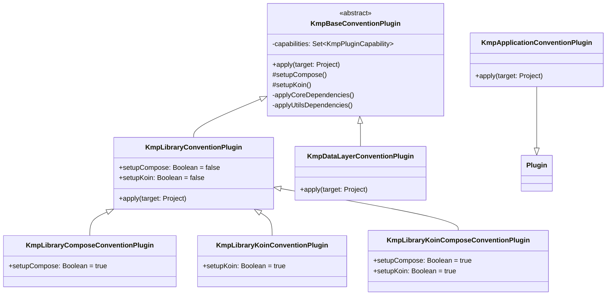

# Design Document: KMP Convention Plugins

## Overview

This design adds a Kotlin Multiplatform (KMP) / Compose Multiplatform (CMP) convention plugin suite to the existing `io.github.appspiriment` Gradle plugin library. The suite mirrors the architecture of the existing Android plugin suite — opinionated defaults, opt-in capabilities, DSL extensions for per-module configuration, and a distributed version catalog — but targets KMP shared modules rather than Android-only modules.

Six new plugins are introduced under the `io.github.appspiriment.kmp.*` namespace:

| Plugin ID | Purpose |
|-----------|---------|
| `io.github.appspiriment.kmp.library` | Base KMP shared module (Android target always on) |
| `io.github.appspiriment.kmp.library-compose` | KMP library + Compose Multiplatform |
| `io.github.appspiriment.kmp.library-koin` | KMP library + Koin DI |
| `io.github.appspiriment.kmp.library-koin-compose` | KMP library + Koin + Compose |
| `io.github.appspiriment.kmp.data` | KMP data layer (SQLDelight, Ktor, DataStore, Serialization) |
| `io.github.appspiriment.kmp.application` | Android host app for a KMP project |

A new `kmplibs.versions.toml` catalog is distributed to consumer projects at sync time, analogous to the existing `appspirimentlibs.versions.toml`. A new `updateKmpLibFileVersion` Gradle task generates `KmpConstants.kt` by embedding the catalog content as a string constant.

### Design Goals

- **Mirror the Android suite**: same `afterEvaluate` pattern, same `Dependency`/`ImplType` helpers, same version-catalog distribution mechanism.
- **Opt-in targets**: iOS, Desktop, and WASM are disabled by default; the `kmp { }` DSL block enables them.
- **No duplication**: combined plugins (e.g. `library-koin-compose`) apply each plugin/dependency exactly once.
- **Configuration-cache compatible**: all extension properties use Gradle's `Property<T>` API.

---

## Architecture

### Component Diagram

```mermaid
graph TD
    subgraph "Consumer Project"
        A[build.gradle.kts<br/>applies kmp.library-koin-compose]
    end

    subgraph "conventions module (JAR)"
        B[KmpLibraryKoinComposeConventionPlugin]
        C[KmpBaseConventionPlugin]
        D[KmpLibraryComposeConventionPlugin]
        E[KmpLibraryKoinConventionPlugin]
        F[KmpDataLayerConventionPlugin]
        G[KmpApplicationConventionPlugin]

        B -->|delegates to| C
        D -->|extends| C
        E -->|extends| C
        B -->|composes| D
        B -->|composes| E
        F -->|extends| C
        G -.->|standalone, reads| KmpExtension
    end

    subgraph "extensions/"
        H[KmpExtension<br/>kmp { }]
        I[KmpDataLayerExtension<br/>kmpDataLayer { }]
        J[KmpDependencies.kt<br/>dependency lists]
        K[KotlinKmp.kt<br/>configureKmpEarly/Late]
        L[KmpProjectConfiguration.kt<br/>kmpProjectConfigs]
        M[KmpConstants.kt<br/>generated — embeds TOML]
    end

    subgraph "gradle/"
        N[kmplibs.versions.toml<br/>source of truth]
    end

    subgraph "updateKmpLibFileVersion task"
        O[reads N, generates M]
    end

    C --> H
    C --> J
    C --> K
    C --> L
    F --> I
    O --> M
    N --> O
    A --> B
```

### Plugin Hierarchy



The `KmpLibraryKoinComposeConventionPlugin` inherits from `KmpLibraryConventionPlugin` with both `setupCompose = true` and `setupKoin = true`. The base class checks the `capabilities` set before adding optional dependencies, preventing duplication.

---

## Components and Interfaces

### File / Package Structure

All new files live under the existing `conventions/src/main/java/com/appspiriment/conventions/` tree:

```
conventions/src/main/java/com/appspiriment/conventions/
├── extensions/
│   ├── CustomExtensions.kt          # existing — Android extensions
│   ├── Dependencies.kt              # existing — Android dependency lists
│   ├── Extensions.kt                # existing — shared helpers (Dependency, ImplType, etc.)
│   ├── KotlinAndroid.kt             # existing
│   ├── KmpCustomExtensions.kt       # NEW — KmpExtension, KmpDataLayerExtension
│   ├── KmpDependencies.kt           # NEW — KMP dependency lists
│   ├── KotlinKmp.kt                 # NEW — configureKmpEarly, configureKmpLate
│   ├── KmpProjectConfiguration.kt   # NEW — kmpProjectConfigs, kmpLibs accessor
│   ├── LibsData.kt                  # existing — AppspirimentLibRef
│   └── ProjectConfiguration.kt     # existing — Android projectConfigs
│   └── Constants.kt                 # existing — generated, Android TOML
│   └── KmpConstants.kt              # NEW (generated) — embeds kmplibs TOML
└── plugins/
    ├── AndroidApplicationConventionPlugin.kt   # existing
    ├── AndroidBaseConventionPlugin.kt          # existing
    ├── AndroidLibraryConventionPlugin.kt       # existing
    ├── KmpApplicationConventionPlugin.kt       # NEW
    ├── KmpBaseConventionPlugin.kt              # NEW
    ├── KmpLibraryConventionPlugin.kt           # NEW
    └── feature/
        ├── AndroidDataLayerConventionPlugin.kt # existing
        └── KmpDataLayerConventionPlugin.kt     # NEW
```

### Shared Helpers (reused from existing code)

The KMP plugins reuse the following from `Extensions.kt` without modification:

- `Dependency` data class and `ImplType` enum
- `implementDependency(libs, dependencyList)` — adds dependencies from a catalog
- `applyPluginFromLibs(vararg pluginGroups)` — applies plugins from a catalog, idempotent

### New: `KmpProjectConfiguration.kt`

Provides the `kmpLibs` version catalog accessor and a cached `kmpProjectConfigs` property, mirroring `ProjectConfiguration.kt`:

```kotlin
val Project.kmpLibs: VersionCatalog
    get() = extensions.getByType<VersionCatalogsExtension>().named(kmpTomlName)

val Project.kmpProjectConfigs: KmpProjectConfiguration
    get() { /* cached in extra properties, reads from kmpLibs */ }

data class KmpProjectConfiguration(
    val minSdk: Int,
    val compileSdk: Int,
    val javaVersion: JavaVersion
)
```

### New: `KotlinKmp.kt`

Contains KMP-specific configuration helpers, analogous to `KotlinAndroid.kt`:

```kotlin
internal fun Project.configureKmpEarly(kotlinExtension: KotlinMultiplatformExtension)
internal fun Project.configureKmpLate(kotlinExtension: KotlinMultiplatformExtension)
internal fun Project.configureAndroidTargetInKmp(kotlinExtension: KotlinMultiplatformExtension)
internal fun Project.configureIosTargets(kotlinExtension: KotlinMultiplatformExtension)
internal fun Project.configureDesktopTarget(kotlinExtension: KotlinMultiplatformExtension)
internal fun Project.configureWasmTarget(kotlinExtension: KotlinMultiplatformExtension)
```

`configureKmpEarly` sets up the Android target (always on) with `compileSdk`, `minSdk`, and `jvmTarget`. `configureKmpLate` is called in `afterEvaluate` and activates the optional targets based on the `KmpExtension` values.

---

## Data Models

### `KmpExtension` (the `kmp { }` DSL block)

Registered under the extension name `"kmp"` on every project that applies a KMP plugin.

```kotlin
internal const val KMP_EXTENSION_NAME = "kmp"

abstract class KmpExtension @Inject constructor(objects: ObjectFactory) {
    /** Activate iosArm64 + iosSimulatorArm64 + iosX64 targets. Default: false. */
    abstract val enableIos: Property<Boolean>
    /** Activate jvm target named "desktop". Default: false. */
    abstract val enableDesktop: Property<Boolean>
    /** Activate wasmJs target with browser execution. Default: false. */
    abstract val enableWasm: Property<Boolean>
    /** Enable R8 minification on release build type (application modules only). Default: false. */
    abstract val enableMinify: Property<Boolean>
    /** Add appspiriment-utils and logutils to the module. Default: true. */
    abstract val enableUtils: Property<Boolean>
}
```

### `KmpDataLayerExtension` (the `kmpDataLayer { }` DSL block)

Registered under the extension name `"kmpDataLayer"` by `KmpDataLayerConventionPlugin`.

```kotlin
internal const val KMP_DATA_LAYER_EXTENSION_NAME = "kmpDataLayer"

abstract class KmpDataLayerExtension @Inject constructor(objects: ObjectFactory) {
    val sqlDelight: SqlDelightConfig = objects.newInstance(SqlDelightConfig::class.java)
    fun sqlDelight(action: Action<SqlDelightConfig>) = action.execute(sqlDelight)

    val ktor: KtorConfig = objects.newInstance(KtorConfig::class.java)
    fun ktor(action: Action<KtorConfig>) = action.execute(ktor)

    val dataStore: SimpleConfig = objects.newInstance(SimpleConfig::class.java)
    fun dataStore(action: Action<SimpleConfig>) = action.execute(dataStore)

    val serialization: SimpleConfig = objects.newInstance(SimpleConfig::class.java)
    fun serialization(action: Action<SimpleConfig>) = action.execute(serialization)
}

abstract class SqlDelightConfig @Inject constructor(objects: ObjectFactory) {
    abstract val enabled: Property<Boolean>
    abstract val schemaVersion: Property<Int>
}

abstract class KtorConfig @Inject constructor(objects: ObjectFactory) {
    abstract val enabled: Property<Boolean>
    abstract val useLogging: Property<Boolean>
}
```

`SimpleConfig` is already defined in `CustomExtensions.kt` and is reused here.

### `KmpPluginCapability` enum

Analogous to the existing `PluginCapability` enum in `AndroidBaseConventionPlugin.kt`:

```kotlin
enum class KmpPluginCapability { KOIN, COMPOSE }
```

### `KmpConstants.kt` (generated)

Generated by `updateKmpLibFileVersion` task, analogous to `Constants.kt`:

```kotlin
package com.appspiriment.conventions.extensions

internal const val kmpTomlName = "kmplibs"
internal const val kmpLibVersion = "CURRENT_VERSION"
internal const val kmpTomlContents = "... embedded TOML ..."

internal val kmpLibRefs = AppspirimentLibRef(
    versions = listOf(...),
    plugins = listOf(...),
    libraries = listOf(...)
)
```

### `kmplibs.versions.toml` — Full Catalog Design

```toml
[versions]
# SDK & tooling
compileSdk = "36"
minSdk = "26"
targetSdk = "36"
javaVersion = "21"

# Plugin version (replaced by updateKmpLibFileVersion task)
kmpAppspiriment = "LIBVERSION"

# KMP core
kotlin = "2.1.21"
coroutines = "1.10.1"

# Compose Multiplatform
composeMultiplatform = "1.8.0"

# Koin
koin = "4.0.4"
koinAnnotations = "2.0.0"
ksp = "2.1.21-2.0.1"

# Ktor
ktor = "3.1.3"

# SQLDelight
sqlDelight = "2.0.2"

# DataStore KMP
datastore = "1.1.4"

# Serialization
kotlinxSerialization = "1.8.1"

# Testing
turbine = "1.2.0"

# Appspiriment utilities
appspirimentLogUtils = "0.0.1"
appspirimentUtils = "0.0.5.dev-11"

[libraries]
# --- COROUTINES ---
kotlinx-coroutines-core = { group = "org.jetbrains.kotlinx", name = "kotlinx-coroutines-core", version.ref = "coroutines" }
kotlinx-coroutines-android = { group = "org.jetbrains.kotlinx", name = "kotlinx-coroutines-android", version.ref = "coroutines" }
kotlinx-coroutines-test = { group = "org.jetbrains.kotlinx", name = "kotlinx-coroutines-test", version.ref = "coroutines" }

# --- SERIALIZATION ---
kotlinx-serialization-json = { group = "org.jetbrains.kotlinx", name = "kotlinx-serialization-json", version.ref = "kotlinxSerialization" }

# --- KOIN ---
koin-core = { group = "io.insert-koin", name = "koin-core", version.ref = "koin" }
koin-android = { group = "io.insert-koin", name = "koin-android", version.ref = "koin" }
koin-compose = { group = "io.insert-koin", name = "koin-compose", version.ref = "koin" }
koin-compose-viewmodel = { group = "io.insert-koin", name = "koin-compose-viewmodel", version.ref = "koin" }
koin-test = { group = "io.insert-koin", name = "koin-test", version.ref = "koin" }
koin-annotations = { group = "io.insert-koin", name = "koin-annotations", version.ref = "koinAnnotations" }
koin-ksp-compiler = { group = "io.insert-koin", name = "koin-ksp-compiler", version.ref = "koinAnnotations" }

# --- KTOR ---
ktor-client-core = { group = "io.ktor", name = "ktor-client-core", version.ref = "ktor" }
ktor-client-okhttp = { group = "io.ktor", name = "ktor-client-okhttp", version.ref = "ktor" }
ktor-client-darwin = { group = "io.ktor", name = "ktor-client-darwin", version.ref = "ktor" }
ktor-client-cio = { group = "io.ktor", name = "ktor-client-cio", version.ref = "ktor" }
ktor-client-js = { group = "io.ktor", name = "ktor-client-js", version.ref = "ktor" }
ktor-client-content-negotiation = { group = "io.ktor", name = "ktor-client-content-negotiation", version.ref = "ktor" }
ktor-client-logging = { group = "io.ktor", name = "ktor-client-logging", version.ref = "ktor" }
ktor-serialization-kotlinx-json = { group = "io.ktor", name = "ktor-serialization-kotlinx-json", version.ref = "ktor" }

# --- SQLDELIGHT ---
sqldelight-runtime = { group = "app.cash.sqldelight", name = "runtime", version.ref = "sqlDelight" }
sqldelight-android-driver = { group = "app.cash.sqldelight", name = "android-driver", version.ref = "sqlDelight" }
sqldelight-native-driver = { group = "app.cash.sqldelight", name = "native-driver", version.ref = "sqlDelight" }
sqldelight-sqlite-driver = { group = "app.cash.sqldelight", name = "sqlite-driver", version.ref = "sqlDelight" }

# --- DATASTORE ---
datastore-preferences-core = { group = "androidx.datastore", name = "datastore-preferences-core", version.ref = "datastore" }

# --- TESTING ---
kotlin-test = { group = "org.jetbrains.kotlin", name = "kotlin-test", version.ref = "kotlin" }
turbine = { group = "app.cash.turbine", name = "turbine", version.ref = "turbine" }

# --- APPSPIRIMENT UTILS ---
appspiriment-logutils-dev = { group = "io.github.appspiriment", name = "logutils-dev", version.ref = "appspirimentLogUtils" }
appspiriment-logutils-prod = { group = "io.github.appspiriment", name = "logutils-prod", version.ref = "appspirimentLogUtils" }
appspiriment-utils = { group = "io.github.appspiriment", name = "utils", version.ref = "appspirimentUtils" }

[plugins]
kotlin-multiplatform = { id = "org.jetbrains.kotlin.multiplatform", version.ref = "kotlin" }
kotlin-compose-compiler = { id = "org.jetbrains.kotlin.plugin.compose", version.ref = "kotlin" }
compose-multiplatform = { id = "org.jetbrains.compose", version.ref = "composeMultiplatform" }
kotlin-serialization = { id = "org.jetbrains.kotlin.plugin.serialization", version.ref = "kotlin" }
devtools-ksp = { id = "com.google.devtools.ksp", version.ref = "ksp" }
sqldelight = { id = "app.cash.sqldelight", version.ref = "sqlDelight" }
android-library = { id = "com.android.library", version.ref = "agp" }
android-application = { id = "com.android.application", version.ref = "agp" }

# Appspiriment KMP Convention Plugins
kmp-library = { id = "io.github.appspiriment.kmp.library", version.ref = "kmpAppspiriment" }
kmp-library-compose = { id = "io.github.appspiriment.kmp.library-compose", version.ref = "kmpAppspiriment" }
kmp-library-koin = { id = "io.github.appspiriment.kmp.library-koin", version.ref = "kmpAppspiriment" }
kmp-library-koin-compose = { id = "io.github.appspiriment.kmp.library-koin-compose", version.ref = "kmpAppspiriment" }
kmp-data = { id = "io.github.appspiriment.kmp.data", version.ref = "kmpAppspiriment" }
kmp-application = { id = "io.github.appspiriment.kmp.application", version.ref = "kmpAppspiriment" }
```

> Note: `agp` version is not defined in `kmplibs.versions.toml` — it is inherited from the consumer project's own `libs.versions.toml`. The `android-library` and `android-application` plugin aliases reference `agp` which must be present in the consumer's primary catalog. Alternatively, the consumer can declare the AGP version in `kmplibs` as well; the design leaves this as a consumer responsibility to avoid version conflicts.

### `KmpDependencies.kt` — Dependency Lists

All KMP dependency lists are defined here, mirroring `Dependencies.kt`. Source set configuration names follow the KMP convention (`commonMainImplementation`, `androidMainImplementation`, etc.):

```kotlin
// Plugin alias lists (applied via applyPluginFromLibs)
val kmpBasePluginList = listOf("kotlin-multiplatform", "android-library")
val kmpComposePluginList = listOf("compose-multiplatform", "kotlin-compose-compiler")
val kmpKoinPluginList = listOf("devtools-ksp")
val kmpSerializationPluginList = listOf("kotlin-serialization")
val kmpSqlDelightPluginList = listOf("sqldelight")

// commonMain dependencies (always applied)
val kmpCoreDependencies: List<Dependency> = listOf(
    Dependency(config = "commonMainImplementation",
               aliases = listOf("kotlinx-coroutines-core"))
)

// commonTest dependencies (always applied)
val kmpTestDependencies: List<Dependency> = listOf(
    Dependency(config = "commonTestImplementation",
               aliases = listOf("kotlin-test", "kotlinx-coroutines-test", "turbine"))
)

// Compose Multiplatform dependencies
val kmpComposeDependencies: List<Dependency> = listOf(
    Dependency(type = ImplType.PLATFORM, config = "commonMainImplementation",
               aliases = listOf("compose-bom")),  // if a CMP BOM exists; otherwise individual
    Dependency(config = "commonMainImplementation",
               aliases = listOf("compose-runtime", "compose-foundation",
                                "compose-material3", "compose-ui",
                                "compose-components-resources")),
    Dependency(config = "androidMainDebugImplementation",
               aliases = listOf("compose-ui-tooling"))
)

// Koin dependencies
val kmpKoinCommonDependencies: List<Dependency> = listOf(
    Dependency(config = "commonMainImplementation",
               aliases = listOf("koin-core", "koin-annotations")),
    Dependency(config = "commonTestImplementation",
               aliases = listOf("koin-test")),
    Dependency(config = "androidMainImplementation",
               aliases = listOf("koin-android"))
)

val kmpKoinComposeDependencies: List<Dependency> = listOf(
    Dependency(config = "commonMainImplementation",
               aliases = listOf("koin-compose", "koin-compose-viewmodel"))
)

// Util dependencies (enableUtils = true)
val kmpUtilDependencies: List<Dependency> = listOf(
    Dependency(config = "commonMainImplementation", aliases = listOf("appspiriment-utils")),
    Dependency(config = "androidMainDebugImplementation",
               aliases = listOf("appspiriment-logutils-dev")),
    Dependency(config = "androidMainReleaseImplementation",
               aliases = listOf("appspiriment-logutils-prod"))
)
```

> **Note on Compose Multiplatform BOM**: As of CMP 1.7+, JetBrains does not publish a standalone BOM for Compose Multiplatform. The `compose.*` accessors (e.g. `compose.runtime`) are provided by the `org.jetbrains.compose` Gradle plugin's own extension on the `KotlinMultiplatformExtension`. The plugin accesses them via `extensions.getByType<ComposeExtension>().dependencies`. The dependency list design above uses catalog aliases that map to the individual CMP artifacts rather than a BOM platform dependency.

---

## Correctness Properties

*A property is a characteristic or behavior that should hold true across all valid executions of a system — essentially, a formal statement about what the system should do. Properties serve as the bridge between human-readable specifications and machine-verifiable correctness guarantees.*

The KMP convention plugin suite is primarily a Gradle configuration system. Most acceptance criteria are binary conditional checks (either a plugin is applied or it isn't) that are best verified with example-based tests. However, two universal properties emerge from the requirements:

1. **No-duplication invariant**: Combined plugins must never apply a plugin or add a dependency more than once, regardless of which capability combination is active.
2. **LIBVERSION replacement**: The `updateKmpLibFileVersion` task must correctly replace the `LIBVERSION` placeholder for any valid version string.

### Property 1: No duplication of plugins and dependencies in combined capability plugins

*For any* KMP convention plugin that composes multiple capabilities (Compose + Koin, or data layer features that share the serialization plugin), each Gradle plugin ID and each dependency coordinate shall appear in the applied configuration at most once, regardless of how many capabilities are active.

**Validates: Requirements 5.1, 5.4, 10.4**

### Property 2: LIBVERSION placeholder replacement is total and correct

*For any* valid semantic version string `v`, running `updateKmpLibFileVersion` with plugin version `v` shall produce a `KmpConstants.kt` file in which every occurrence of the literal string `LIBVERSION` in the source TOML has been replaced by `v`, and no other content in the TOML is modified.

**Validates: Requirements 11.5, 15.5**

---

## Error Handling

### Missing Version Catalog Entries

If a required version alias (e.g. `compileSdk`, `minSdk`) is absent from `kmplibs.versions.toml`, `kmpProjectConfigs` throws an `IllegalStateException` with a descriptive message identifying the missing alias and catalog name. This mirrors the existing behavior in `Extensions.kt`'s `getVersion()`.

### Missing TOML File at Task Execution

If `gradle/kmplibs.versions.toml` does not exist when `updateKmpLibFileVersion` runs, the task logs a `warn`-level message and returns early without writing `KmpConstants.kt` and without failing the build. This matches the existing `updateLibFileVersion` behavior.

### Unsupported KMP Targets

The plugins do not suppress or wrap KMP toolchain errors. If `enableIos = true` is set on a build host without Xcode, the standard Kotlin Multiplatform Gradle error propagates unchanged to the developer. No try/catch blocks are placed around target configuration calls.

### Duplicate Plugin Application

`applyPluginFromLibs` (from `Extensions.kt`) already guards against duplicate plugin application with a `hasPlugin` check. The KMP plugins rely on this existing guard — no additional deduplication logic is needed in the plugin classes themselves.

### `afterEvaluate` Ordering

All reads of `KmpExtension` and `KmpDataLayerExtension` property values happen inside `afterEvaluate` blocks. Reading a `Property<Boolean>` before the user's build script has been evaluated returns the unset default (`null`), which is treated as `false` for all opt-in flags and `true` for `enableUtils`. This is consistent with the existing Android plugin behavior.

### KSP Configuration for Koin

KSP must be configured for each enabled KMP target separately. The `KmpLibraryKoinConventionPlugin` iterates over the set of enabled targets (determined in `afterEvaluate`) and adds `koin-ksp-compiler` to each target's KSP configuration (`kspAndroid`, `kspIosArm64`, `kspIosSimulatorArm64`, `kspIosX64`, `kspDesktop`). If a target is not enabled, its KSP configuration is not touched.

---

## Testing Strategy

### Dual Testing Approach

Unit tests verify specific examples and edge cases. Property-based tests verify the two universal properties identified above.

### Unit Tests (Example-Based)

Each plugin class gets a corresponding test class using Gradle TestKit. Tests apply the plugin to a minimal project and assert the resulting configuration. Key test scenarios:

**`KmpLibraryConventionPluginTest`**
- Applying the plugin registers the `kmp` extension
- Default configuration applies only the Android target
- `enableIos = true` adds three iOS targets and creates `iosMain`/`iosTest` source sets
- `enableDesktop = true` adds a `jvm` target named `desktop` and creates `desktopMain`/`desktopTest`
- `enableWasm = true` adds `wasmJs` target with browser execution and creates `wasmJsMain`/`wasmJsTest`
- `commonMain` always contains `kotlinx-coroutines-core`
- `commonTest` always contains `kotlin-test`, `kotlinx-coroutines-test`, `turbine`

**`KmpLibraryComposeConventionPluginTest`**
- All `KmpLibraryConventionPlugin` capabilities are present
- `org.jetbrains.compose` and `org.jetbrains.kotlin.plugin.compose` are applied
- Compose dependencies are in `commonMain`
- `compose.uiTooling` is in `androidMain` debug configuration
- `enableDesktop = true` adds `compose.desktop.currentOs` to `desktopMain`

**`KmpLibraryKoinConventionPluginTest`**
- All `KmpLibraryConventionPlugin` capabilities are present
- `com.google.devtools.ksp` is applied
- `koin-core` and `koin-annotations` are in `commonMain`
- `koin-android` is in `androidMain`
- `koin-test` is in `commonTest`
- KSP compiler is added for each enabled target

**`KmpLibraryKoinComposeConventionPluginTest`**
- `koin-compose` and `koin-compose-viewmodel` are in `commonMain`
- No plugin or dependency appears more than once (example-based verification)

**`KmpDataLayerConventionPluginTest`**
- No optional dependencies added when no `kmpDataLayer` block is configured
- `sqlDelight.enabled = true` applies SQLDelight plugin and adds platform-appropriate drivers
- `ktor.enabled = true` applies serialization plugin and adds platform-appropriate Ktor engines
- `ktor.useLogging = true` adds `ktor-client-logging` to `commonMain`
- `dataStore.enabled = true` adds `datastore-preferences-core` to `commonMain`
- `serialization.enabled = true` applies serialization plugin and adds `kotlinx-serialization-json`
- Both `ktor.enabled = true` and `serialization.enabled = true` result in serialization plugin applied once

**`KmpApplicationConventionPluginTest`**
- `com.android.application` and `org.jetbrains.kotlin.android` are applied
- Compose plugins are applied
- `kotlinx-coroutines-android` is in `implementation`
- `enableMinify = true` enables R8 on the release build type

**`UpdateKmpLibFileVersionTaskTest`**
- Task skips gracefully when TOML file is missing
- Generated `KmpConstants.kt` contains the embedded TOML content
- `LIBVERSION` placeholder is replaced with the current version

### Property-Based Tests

Property-based tests use [Kotest Property Testing](https://kotest.io/docs/proptest/property-based-testing.html) (or `kotlin-test` with a simple generator) since the plugin module already targets JVM.

**Property Test 1: No duplication invariant**

```
// Feature: kmp-convention-plugins, Property 1: No duplication of plugins and dependencies
// Minimum 100 iterations
forAll(
    Arb.subset(setOf(COMPOSE, KOIN)),          // random capability subsets
    Arb.subset(setOf(IOS, DESKTOP, WASM))      // random target subsets
) { capabilities, targets ->
    val project = buildProjectWithCapabilities(capabilities, targets)
    val appliedPluginIds = project.pluginManager.appliedPluginIds()
    val allDependencies = project.allKmpDependencies()
    
    appliedPluginIds.size == appliedPluginIds.toSet().size &&
    allDependencies.size == allDependencies.toSet().size
}
```

**Property Test 2: LIBVERSION replacement**

```
// Feature: kmp-convention-plugins, Property 2: LIBVERSION placeholder replacement
// Minimum 100 iterations
forAll(Arb.semVer()) { version ->
    val tomlWithPlaceholder = generateTomlWithLibversion()
    val result = processToml(tomlWithPlaceholder, version)
    
    !result.contains("LIBVERSION") &&
    result.contains(version) &&
    result.replace(version, "LIBVERSION") == tomlWithPlaceholder
}
```

### Test Configuration

- Minimum **100 iterations** per property test
- Each property test is tagged with: `Feature: kmp-convention-plugins, Property {N}: {property_text}`
- Unit tests use Gradle TestKit with a minimal multi-project build
- Property tests run on JVM only (no KMP test runner needed for plugin logic)

---

## `KmpBaseConventionPlugin` — Detailed Class Design

```kotlin
enum class KmpPluginCapability { KOIN, COMPOSE }

abstract class KmpBaseConventionPlugin : Plugin<Project> {

    private val capabilities = mutableSetOf<KmpPluginCapability>()

    override fun apply(target: Project) {
        with(target) {
            // 1. Register kmp { } extension early
            extensions.create(KMP_EXTENSION_NAME, KmpExtension::class.java)

            // 2. Apply mandatory plugins (kotlin-multiplatform, android-library)
            pluginManager.applyPluginFromLibs(kmpLibs to kmpBasePluginList)

            // 3. Configure Android target early (compileSdk, minSdk, jvmTarget)
            extensions.configure<KotlinMultiplatformExtension> {
                configureKmpEarly(this)
            }

            // 4. Apply core commonMain/commonTest dependencies
            applyCoreDependencies()

            // 5. Defer target activation and optional deps to afterEvaluate
            afterEvaluate {
                val kmpExt = extensions.getByType<KmpExtension>()
                extensions.configure<KotlinMultiplatformExtension> {
                    configureKmpLate(this, kmpExt)
                }
                if (kmpExt.enableUtils.getOrElse(true)) {
                    applyUtilsDependencies()
                }
            }
        }
    }

    protected fun Project.setupCompose() {
        capabilities += KmpPluginCapability.COMPOSE
        pluginManager.applyPluginFromLibs(kmpLibs to kmpComposePluginList)
        // Compose deps added in afterEvaluate (need to know which targets are active)
    }

    protected fun Project.setupKoin() {
        capabilities += KmpPluginCapability.KOIN
        pluginManager.applyPluginFromLibs(kmpLibs to kmpKoinPluginList)
        // Koin deps added in afterEvaluate (need to know which targets for KSP)
    }

    internal fun hasCapability(cap: KmpPluginCapability) = cap in capabilities
}
```

## `KmpLibraryConventionPlugin` — Detailed Class Design

```kotlin
open class KmpLibraryConventionPlugin : KmpBaseConventionPlugin() {
    open val setupCompose: Boolean = false
    open val setupKoin: Boolean = false

    override fun apply(target: Project) {
        target.run {
            if (setupCompose) setupCompose()
            if (setupKoin) setupKoin()
            super.apply(this)
        }
    }
}

class KmpLibraryComposeConventionPlugin : KmpLibraryConventionPlugin() {
    override val setupCompose = true
}

class KmpLibraryKoinConventionPlugin : KmpLibraryConventionPlugin() {
    override val setupKoin = true
}

class KmpLibraryKoinComposeConventionPlugin : KmpLibraryConventionPlugin() {
    override val setupCompose = true
    override val setupKoin = true
}
```

## `KmpDataLayerConventionPlugin` — Detailed Class Design

```kotlin
class KmpDataLayerConventionPlugin : KmpBaseConventionPlugin() {

    override fun apply(target: Project) {
        with(target) {
            val dataConfig = extensions.create<KmpDataLayerExtension>(
                KMP_DATA_LAYER_EXTENSION_NAME
            )
            super.apply(this)  // registers kmp { }, applies base plugins, configures Android target

            afterEvaluate {
                val kmpExt = extensions.getByType<KmpExtension>()
                val enableIos = kmpExt.enableIos.getOrElse(false)
                val enableDesktop = kmpExt.enableDesktop.getOrElse(false)
                val enableWasm = kmpExt.enableWasm.getOrElse(false)

                dependencies {
                    val libs = kmpLibs
                    var serializationPluginApplied = false

                    // SQLDelight
                    if (dataConfig.sqlDelight.enabled.getOrElse(false)) {
                        pluginManager.applyPluginFromLibs(libs to kmpSqlDelightPluginList)
                        add("commonMainImplementation", libs.findLibrary("sqldelight-runtime").get())
                        add("androidMainImplementation", libs.findLibrary("sqldelight-android-driver").get())
                        if (enableIos) add("iosMainImplementation", libs.findLibrary("sqldelight-native-driver").get())
                        if (enableDesktop) add("desktopMainImplementation", libs.findLibrary("sqldelight-sqlite-driver").get())
                        // configure SQLDelight extension: linkSqlite = true for Android
                    }

                    // Ktor
                    if (dataConfig.ktor.enabled.getOrElse(false)) {
                        if (!serializationPluginApplied) {
                            pluginManager.applyPluginFromLibs(libs to kmpSerializationPluginList)
                            serializationPluginApplied = true
                        }
                        implementDependency(libs, kmpKtorCommonDependencies)
                        add("androidMainImplementation", libs.findLibrary("ktor-client-okhttp").get())
                        if (enableIos) add("iosMainImplementation", libs.findLibrary("ktor-client-darwin").get())
                        if (enableDesktop) add("desktopMainImplementation", libs.findLibrary("ktor-client-cio").get())
                        if (enableWasm) add("wasmJsMainImplementation", libs.findLibrary("ktor-client-js").get())
                        if (dataConfig.ktor.useLogging.getOrElse(false)) {
                            add("commonMainImplementation", libs.findLibrary("ktor-client-logging").get())
                        }
                    }

                    // DataStore
                    if (dataConfig.dataStore.enabled.getOrElse(false)) {
                        add("commonMainImplementation", libs.findLibrary("datastore-preferences-core").get())
                    }

                    // Serialization (standalone)
                    if (dataConfig.serialization.enabled.getOrElse(false)) {
                        if (!serializationPluginApplied) {
                            pluginManager.applyPluginFromLibs(libs to kmpSerializationPluginList)
                            serializationPluginApplied = true
                        }
                        add("commonMainImplementation", libs.findLibrary("kotlinx-serialization-json").get())
                    }
                }
            }
        }
    }
}
```

## `KmpApplicationConventionPlugin` — Detailed Class Design

This plugin is standalone (does not extend `KmpBaseConventionPlugin`) because it targets an Android application module, not a KMP shared module. It mirrors `AndroidApplicationConventionPlugin` but reads from `kmpLibs` instead of `appspirimentLibs`.

```kotlin
class KmpApplicationConventionPlugin : Plugin<Project> {

    override fun apply(target: Project) {
        with(target) {
            extensions.create(KMP_EXTENSION_NAME, KmpExtension::class.java)

            pluginManager.applyPluginFromLibs(
                kmpLibs to listOf("android-application"),
                kmpLibs to listOf("kotlin-android"),   // org.jetbrains.kotlin.android
                kmpLibs to listOf("compose-multiplatform", "kotlin-compose-compiler")
            )

            // Configure Android extension early
            extensions.configure<ApplicationExtension> {
                compileSdk = kmpProjectConfigs.compileSdk
                defaultConfig {
                    minSdk = kmpProjectConfigs.minSdk
                    targetSdk = kmpProjectConfigs.compileSdk
                }
                compileOptions {
                    sourceCompatibility = kmpProjectConfigs.javaVersion
                    targetCompatibility = kmpProjectConfigs.javaVersion
                }
            }

            // Core dependencies
            dependencies {
                add("implementation", kmpLibs.findLibrary("kotlinx-coroutines-android").get())
                // Compose BOM + runtime/ui/material3/foundation
                // compose.uiTooling as debugImplementation
            }

            afterEvaluate {
                val kmpExt = extensions.getByType<KmpExtension>()
                if (kmpExt.enableMinify.getOrElse(false)) {
                    extensions.configure<ApplicationExtension> {
                        buildTypes.getByName("release") { isMinifyEnabled = true }
                    }
                }
                if (kmpExt.enableUtils.getOrElse(true)) {
                    dependencies {
                        add("implementation", kmpLibs.findLibrary("appspiriment-utils").get())
                        add("debugImplementation", kmpLibs.findLibrary("appspiriment-logutils-dev").get())
                        add("releaseImplementation", kmpLibs.findLibrary("appspiriment-logutils-prod").get())
                    }
                }
            }
        }
    }
}
```

## `updateKmpLibFileVersion` Task Design

Added to `conventions/build.gradle.kts` alongside the existing `updateLibFileVersion` task:

```kotlin
val kmpGeneratedSourceDir = layout.buildDirectory.dir("generated/kmp/kotlin")

val updateKmpLibFileVersion = tasks.register("updateKmpLibFileVersion") {
    group = "versioning"
    description = "Generates KmpConstants.kt with the baked-in KMP TOML catalog and plugin version."

    val tomlFile = rootProject.file("gradle/kmplibs.versions.toml")
    val constantsFile = kmpGeneratedSourceDir.map {
        it.file("com/appspiriment/conventions/extensions/KmpConstants.kt")
    }

    inputs.file(tomlFile)
    inputs.property("pluginVersion", currentVersion)
    outputs.dir(kmpGeneratedSourceDir)

    doLast {
        if (!tomlFile.exists()) {
            logger.warn("⚠️ kmplibs.versions.toml not found — skipping KmpConstants.kt generation")
            return@doLast
        }
        // Same parsing logic as updateLibFileVersion:
        // 1. Read TOML, replace LIBVERSION with currentVersion
        // 2. Parse [versions], [plugins], [libraries] sections
        // 3. Escape content for Kotlin string literal
        // 4. Write KmpConstants.kt with kmpTomlName, kmpLibVersion, kmpTomlContents, kmpLibRefs
    }
}

// Wire into the Kotlin source set
kotlin {
    sourceSets.main {
        kotlin.srcDir(updateKmpLibFileVersion)
    }
}
```

## `conventions/build.gradle.kts` Plugin Registration Changes

Six new plugin registrations are added to the `gradlePlugin { plugins { } }` block:

```kotlin
create("kmpLibrary") {
    id = "io.github.appspiriment.kmp.library"
    displayName = "Appspiriment KMP Library"
    description = "Base KMP shared module setup (Android target always on, iOS/Desktop/WASM opt-in)."
    implementationClass = "com.appspiriment.conventions.plugins.KmpLibraryConventionPlugin"
}
create("kmpLibraryCompose") {
    id = "io.github.appspiriment.kmp.library-compose"
    displayName = "Appspiriment KMP Library (Compose)"
    description = "KMP shared module with Compose Multiplatform UI."
    implementationClass = "com.appspiriment.conventions.plugins.KmpLibraryComposeConventionPlugin"
}
create("kmpLibraryKoin") {
    id = "io.github.appspiriment.kmp.library-koin"
    displayName = "Appspiriment KMP Library (Koin)"
    description = "KMP shared module with Koin dependency injection."
    implementationClass = "com.appspiriment.conventions.plugins.KmpLibraryKoinConventionPlugin"
}
create("kmpLibraryKoinCompose") {
    id = "io.github.appspiriment.kmp.library-koin-compose"
    displayName = "Appspiriment KMP Library (Koin + Compose)"
    description = "KMP shared module with Koin DI and Compose Multiplatform UI."
    implementationClass = "com.appspiriment.conventions.plugins.KmpLibraryKoinComposeConventionPlugin"
}
create("kmpData") {
    id = "io.github.appspiriment.kmp.data"
    displayName = "Appspiriment KMP Data Layer"
    description = "KMP data layer with opt-in SQLDelight, Ktor, DataStore, and Serialization."
    implementationClass = "com.appspiriment.conventions.plugins.feature.KmpDataLayerConventionPlugin"
}
create("kmpApplication") {
    id = "io.github.appspiriment.kmp.application"
    displayName = "Appspiriment KMP Application"
    description = "Android host app module for a KMP project (Compose + coroutines by default)."
    implementationClass = "com.appspiriment.conventions.plugins.KmpApplicationConventionPlugin"
}
```

The `updateKmpLibFileVersion` task is also wired into the `sourcesJar` task dependency, matching the existing pattern for `updateLibFileVersion`.

## Consumer Usage Examples

### Minimal KMP shared module

```kotlin
// shared/build.gradle.kts
plugins {
    alias(kmplibs.plugins.kmp.library.koin.compose)
}

kmp {
    enableIos.set(true)
    enableDesktop.set(true)
}
```

### KMP data module

```kotlin
// data/build.gradle.kts
plugins {
    alias(kmplibs.plugins.kmp.data)
}

kmp {
    enableIos.set(true)
}

kmpDataLayer {
    ktor {
        enabled.set(true)
        useLogging.set(true)
    }
    sqlDelight {
        enabled.set(true)
    }
    dataStore {
        enabled.set(true)
    }
}
```

### Android host app

```kotlin
// app/build.gradle.kts
plugins {
    alias(kmplibs.plugins.kmp.application)
}

kmp {
    enableMinify.set(true)
}
```
